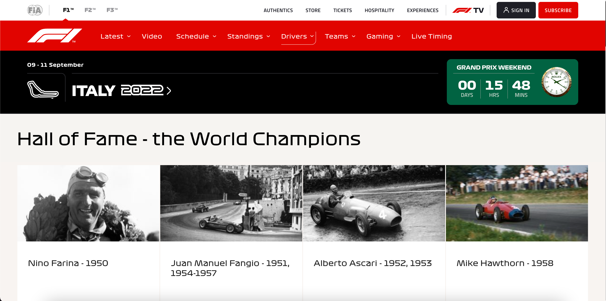
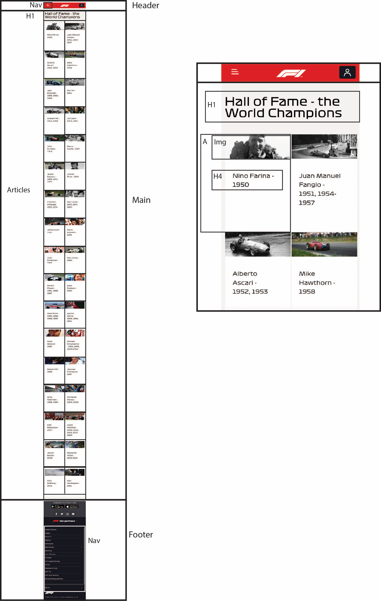
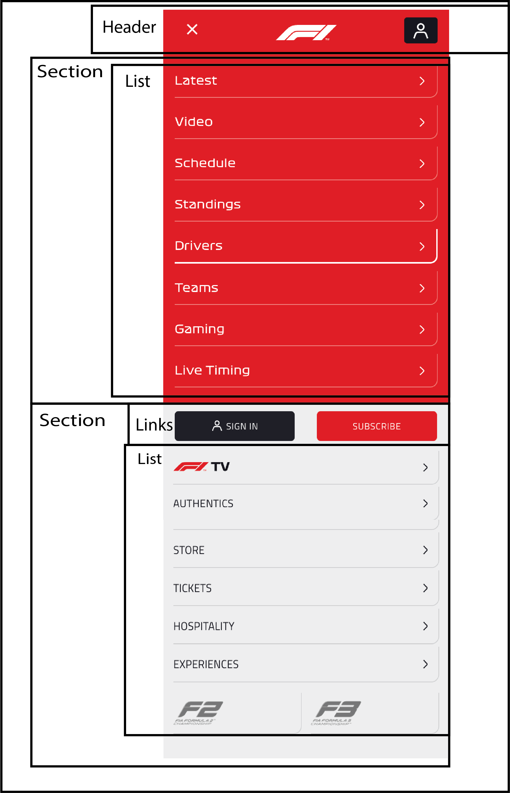
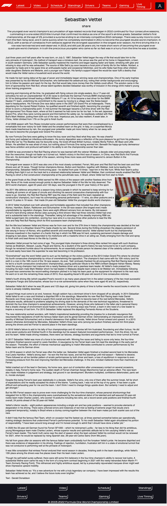
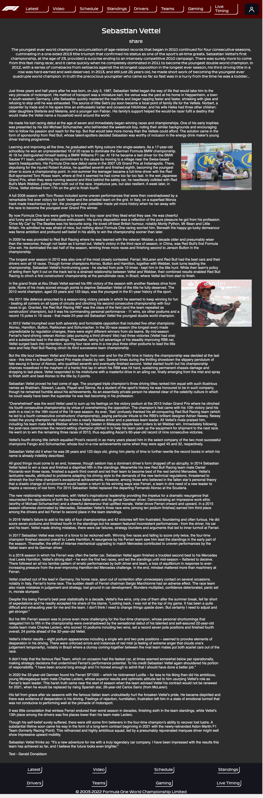
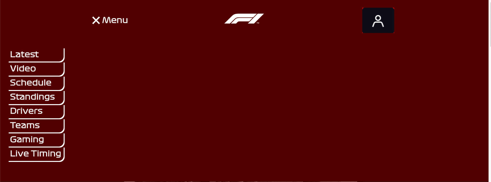
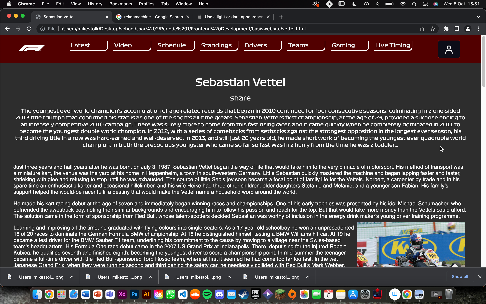

# Procesverslag
Markdown is een simpele manier om HTML te schrijven.  
Markdown cheat cheet: [Hulp bij het schrijven van Markdown](https://github.com/adam-p/markdown-here/wiki/Markdown-Cheatsheet).

Nb. De standaardstructuur en de spartaanse opmaak van de README.md zijn helemaal prima. Het gaat om de inhoud van je procesverslag. Besteedt de tijd voor pracht en praal aan je website.

Nb. Door *open* toe te voegen aan een *details* element kun je deze standaard open zetten. Fijn om dat steeds voor de relevante stuk(ken) te doen.

## Jij

  
uitwerken voor kick-off werkgroep

  ### Auteur:
  Mike Stolk

  #### Je startniveau:
  Blauw/Rood

  #### Je focus:
  Responsive
 

## Je website

  
uitwerken voor kick-off werkgroep

  ### Je opdracht:
  https://www.formula1.com/en/drivers/hall-of-fame.html

  #### Screenshot(s) van de eerste pagina (small screen): 
  hier de naam van de pagina  
  

  #### Screenshot(s) van de tweede pagina (small screen):
  hier de naam van de pagina  
  
 

## Toegankelijkheidstest 1/2 (week 1)

  
uitwerken na test in 1e werkgroep

  ### Bevindingen
  Lijst met je bevindingen die in de test naar voren kwamen:

  #### Screenreader
  De website van de Formule 1 is goed te navigeren. Maar de screenreader neemt niet de grote rode navigation bar mee als hij de website begint voor te lezen.
  Dit zorgt ervoor dat een groot deel van belangrijke informatie wordt overgeslagen. 

  Hier een omschrijving van hoe het opgelost kan worden (met indien nodig afbeeldingen)
  Mijn manier om dit op te lossen is om te proberen de navigation wel leesbaar te maken voor een screenreader

  #### Muis en Toetsenbord 
 deze test moet ik nog doen omdat ik het niet werkende kreeg....

  Hier een omschrijving van hoe het opgelost kan worden (met indien nodig afbeeldingen)

  #### Motoriek (shocks, elastiekjes)
  De website van F1 is goed te bezoeken met een Motorieke beperking. het scrollen gaat gemakkelijk. en als je plotesling een knop indrukt dan kan je snel weer,  terug navigeren. Voor de rest als je bijvoorbeeld 2 vingers aan elkaar had was de website nog steeds goed te navigeren. Soms was het wat lastiger omdat voor Mac
  een van de shortcuts met 2 vingers om de mousepad klikken is. 

  Hier een omschrijving van hoe het opgelost kan worden (met indien nodig afbeeldingen)

  #### Visueel (brillen, contrast, kleurenblind, dark/light). 
  De test met Dark/Light werkte niet omdat de Formule 1 website geen Darkmode Support. 
  Maar de test met wazige visie en tunnelvisie zorgde ervoor dat ik erachter kwam dat de plaatjes niet altijd even scherp zijn voor iedereen
  en de letters ook niet altijd te lezen zijn omdat deze te klein zijn.

  Hier een omschrijving van hoe het opgelost kan worden (met indien nodig afbeeldingen)
    Ik ga dit oplossen door de plaatjes en het lettertype te vergroten zodat het beter leesbaar is. Ook ga ik ervoor zorgen dat er een Darkmode functie is voor de
    website zodat de website ook toegankelijk is voor mensen die niet goed tegen vel licht kunnen.

## Breakdownschets (week 1)

  
uitwerken na afloop 2e werkgroep

  ### de hele pagina: 
  

  ### dynamisch deel (bijv menu): 
  

## Voortgang 1 (week 2)

  
uitwerken voor 1e voortgang

  ### Stand van zaken
  hier dit ging goed & dit was lastig (neem ook screenshots op van delen van je website en code)
  
  Wat ging goed:
  - het opstellen van de website
  - de content plaatsen op de website
  - de juiste content vinden
  - de juiste informatie vinden

  Wat was lastig:
  - het gebruiken van CSS Grid is nog best lastig
  - het correct opstellen van de website is lastig
  - de images de juiste grootte geven is lastig

  ### Agenda voor meeting
  samen met je groepje opstellen

  | Mike              | student 2          | student 3    | student 4        |
  | ---               | ---                | ---          | ---              |
  | ik wil bespreken  | en dit             | en ik dit    | en dan ik dat    |
  | hoe ik de grid op | dit als er tijd is | nog een punt | dit wil ik zeker |
  | mijn website beter| ...                | ...          | ...              |
  | maak en daardoor  |
  | de website mooier |
  | en dichter bij het|
  | origineel maak    |

  ### Verslag van meeting
  hier na afloop snel de uitkomsten van de meeting vastleggen

 - punt 1: van de articles List items maken
  - punt 2: CSS Logischer neerzetten
  - punt 3: Flex gebruiken IPV Grid
  - punt 4: Begin met het maken van de website op basis van de Mobile view ipv de desktop view.

## Voortgang 2 (week 3)

  
uitwerken voor 2e voortgang

  ### Stand van zaken
  hier dit ging goed & dit was lastig (neem ook screenshots op van delen van je website en code)
  

  Dit ging beter dan verwacht: 
  - De overstap van Flex naar Grid
  - het responsive maken van de website

  Dit is latig:
  - Responsive menu maken
  

  ### Agenda voor meeting
  samen met je groepje opstellen

  | student 1  Mike    student 2 Quinesha | student 3  Deniz  | student 4 Michelle  |
  | ---              | ---                | ---               | ---                 |
  | Hoe maak ik een  | Hoe zet ik een     | Hoe maak ik de    | hoe maak ik een     |
  | responsive menu  | carousel naast     | Adam/Barcelona    |  Uitklapbaar menu   |
  | ...              |  een list          | button            | hoe zorg ik ervoor  |
  | ...              |  ...               | Hoe maak je een   | det er min 2 en max |
  | ...              |  ...               | Slideshow van     | 4 items op een rij  |
  | ...              |  ...               | text              | staan               |
  | ...              |  ...               | hoe maak ik de    |                     |
  | ...              |  ...               | header en main van|                     |
  | ...              |  ...               | mijn About Moco   |                     |
  | ...              |  ...               | Page?             |                     |

  ### Verslag van meeting
  hier na afloop snel de uitkomsten van de meeting vastleggen

  - Het maken van een responsive menu is makkelijker dan gedacht
  - De website ziet er goed uit
  - Niet heel handig dat ik vanuit Desktop ben gestart maar dat heb ik opgelost
  - ...

## Toegankelijkheidstest 2/2 (week 4)

  
uitwerken na test in 8e werkgroep

  ### Bevindingen
  Lijst met je bevindingen die in de test naar voren kwamen (geef ook aan wat er verbeterd is):

  #### Screenreader
  De screenreader leest alles voor, alleen moet ik de alt tekst aanpassen bij sommige foto's

  Hier een omschrijving van hoe het opgelost kan worden (met indien nodig afbeeldingen)

  de alt tekst aanpassen bij bepaalde images

  #### Muis en Toetsenbord 
  de Tab knop werkte nog niet voor alles.
  De website is goed te gebruiken met pijltjes toetsen.

  Hier een omschrijving van hoe het opgelost kan worden (met indien nodig afbeeldingen)

    Links (a href) toevoegen in de Li zodat je kan Tabben.

  #### Motoriek (shocks, elastiekjes)
  De Website is goed te gebruiken als je een motorische beperking hebt, de buttons zijn niet te klein 
  en alles is goed te gebruiken en te klikken.

  Hier een omschrijving van hoe het opgelost kan worden (met indien nodig afbeeldingen)

  #### Visueel (brillen, contrast, kleurenblind, dark/light). 
  De tekst is groot genoeg,
  Images zijn groot genoeg,
  Dark mode doet het nog niet,

  Hier een omschrijving van hoe het opgelost kan worden (met indien nodig afbeeldingen)

  Dark mode toevoegen.

## Voortgang 3 (week 4)

  
uitwerken voor 3e voortgang

  ### Stand van zaken
  hier dit ging goed & dit was lastig (neem ook screenshots op van delen van je website en code)

  Dit ging goed:
  Het maken van de tweede pagina
  Het toevoegen en Stylen van de content
  Het toevoegen van de finishing touches

  Dit was Lastig:
  Het maken van een automatische image slider
  Het Stylen van de content naar het midden van de pagina

  ### Agenda voor meeting
  samen met je groepje opstellen

  | Mike            | Quinesha            | Deniz         | Michelle            |
  | ---             | ---                 | ---           | ---                 |
  | Hoe maak ik een | Hoe plaats ik het   | 1. hoe fix ik | Hoe zorg ik evoor   |
  | Automatische    | best een button op  | mijn header   | dat mijn teksten    |
  | image carousel  | een bepaalde plek   | 2.Hoe zet ik  | niet over mijn      |
  | ...             | Hoe maak ik een     | een lijn bij  | sticky header       |
  | ...             | Circel met een icon | mijn footer   | floaten             | 
  | ...             | er in               | 3.Hoe maak ik |                     |
  | ...             | Hoe zorg ik dat een | een cookies   |                     |
  | ...             | plaatje niet de     | button        |                     |
  | ...             | bovenkant van een   |               |                     |
  | ...             | button overlapt     |               |                     |

  ### Verslag van meeting
  hier na afloop snel de uitkomsten van de meeting vastleggen

  - Carousel maken kan met animaties of je moet echt een carousel maken die verstopt zit
  - De tekst goed alignen komt vanzelf wel
  - De website ziet er goed uit

## Eindgesprek (week 5)

  
uitwerken voor eindgesprek

  ### Je uitkomst - karakteristiek screenshots:
  

  

  

  

  ### Dit ging goed/Heb ik geleerd: 
  Korte omschrijving met plaatjes

 

 

  Wat voornamelijk goed ging was het werken met Grid en Flexbox, in het begin had ik hier nogal wat moeite mee
  maar naar mate ik er meer mee begon te werken, hoe makkelijk het begon te worden.

  Wat ook goed ging en waar ik zeer trots op ben is het responsive maken van de website. Ik had helaas de fout gemaakt door groot te beginnen, waardoor de uiteindelijke versie erg raar werdt opgebouwd. Ik heb dit uiteindelijk opgelost door simpel weg de code om te draaien zodat het van small screen naar large screen ging. 

  Dit heb ik geleerd:
  Hoe CSS Grid werkt,
  Hoe ik een responsive menu kan maken,
  Hoe ik een responsive Grid maak,
  Hoe ik de website het beste responsive kan maken,
  Hoe ik een website met darkmode kan maken.

  ### Dit was lastig/Is niet gelukt:
  Korte omschrijving met plaatjes

  
  
  

  Wat voornamelijk lastig was, was in de laatste week het maken van de tweede pagina. Hier zat namelijk 2 image carousels in die zowel automatisch als handmatig doorheen gescrolld kon worden. Het is niet gelukt om dit 100% te doen dus heb ik ipv er van een animatie gemaakt die er doorheen gaat. 

  Wat ook lastig was, was met de responsive header ervoor zorgen dat het naast elkaar kwam. Dit is jammer genoeg ook niet gelukt. (colomn moest namelijk 4 items displayen naast elkaar). Ook is het niet gelukt om de teksten op de tweede pagina compleet te alignen naar het midden zoals ze op de echte website wel hebben.

## Bronnenlijst

  
continu bijhouden terwijl je werkt

  Nb. Wees specifiek ('css-tricks' als bron is bijv. niet specifiek genoeg).

  1. animatie: https://www.youtube.com/watch?v=UzJ9odr04cM&ab_channel=Codewithwillx
  2. Jop Molenaar
  3. menu button: https://codepen.io/shooft/pen/bGvxPmP
  4. Bron voor alle foto's: https://www.formula1.com/en/drivers/hall-of-fame.html
  5. Bron voor de foto's 2e pagina: https://www.formula1.com/en/drivers/hall-of-fame/Sebastian_Vettel.html
  6. Bron voor schaduwen: https://www.w3schools.com/css/css3_shadows_box.asp

